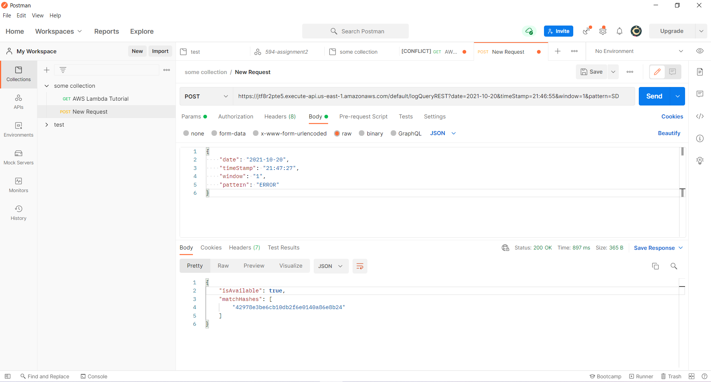
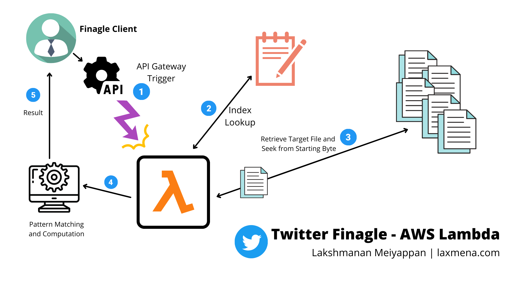

# REST and AWS Lambda using Twitter Finagle 

This project is an implementation of Twitter's Finagle to trigger AWS Lambda with REST API through AWS API Gateway.

- Author: [Lakshmanan Meiyappan](https://laxmena.com)
- NetID: [lmeiya2@uic.edu](mailto:lmeiya2@uic.edu)

## Installation

Steps to install the project:
1. Clone the project from [GitHub](https://github.com/laxmena/finagle-client.git) using `git clone`
    ```shell
    git clone https://github.com/laxmena/finagle-client.git
   ```
2. Install the dependencies using `sbt`
    ```shell
    sbt clean compile assembly
    ```
3. Run the project using `sbt run`
    ```shell
    sbt "run [date] [timeStamp] [window]"
    ```
Example: `sbt "run 2021-11-02 1:30:45 1"`

- **Date Format**: `YYYY-MM-DD`
- **Time Format**: `HH:MM:SS`
- **Window**: integer value in minutes

## Functionality
### Finagle Client
1. Gets input from client and validates the input
2. Calls the AWS Gateway API to trigger Lambda function
3. Returns the response from Lambda function

Language: Scala | Framework: Finagle

### AWS Lambda Function
1. Supports the following HTTP methods: GET, POST
2. Supports the following HTTP headers:
    - `Content-Type`: `application/json`
3. Requires the following input parameters:
    - `date`: `YYYY-MM-DD`
    - `timeStamp`: `HH:MM:SS`
    - `window`: integer value in minutes
4. Checks LogFile Index to get the list of files, and starting byte position for the given timestamp within the file.
5. Loads the file from S3 bucket, from the starting byte position.
6. Checks for all pattern matches in the logfiles in the specified window.
7. Converts the matches into `md5 hashes` and returns it to client.
8. If there is no logs available for specified window, it returns `404` with message.

Language: Python | Dependencies: boto3, hashlib, json, pickle 

### Example:
```shell
sbt "run 2021-10-20 21:46:55 1"
```
### Example Response:
```shell
{"isAvailable": true, "matchHashes": ["95f52588921f1fd246f39696ca423556", "04c3d10b1f6b0a75f49429e87c08d202", "648fc8438d9727b1db25ac203b7e96d0", "aeaae59adf2039491054eef598a7ce27",
"aba582241e5ac179b31cbd205ef6b905", "b6a49fd02f1a38955ebd47b6e39d1c07", "7eda16cc510b49c46f0966c8f3d28b06", "af75ac666f6d4293f1adbdc8905575e2", "87e87e0c4a1b73c0dfbf66b71880b90d", "f7bfe076dd461afe326ebae315b61858", "c30d423269a286a
cfebea871c209a0e4", "2833ca97b7a78938511b76190f1ff7bc", "96aafa47b0eb524a3d0e63ffbdc7f738", "b3320a0a11374a5575685bfb04be1f43", "a70216a183cb2e8094b6513df4204d6c", "b6da697709c1149a687a0e4bfd737710", "916fd64ce7e5b8fbb3a86cddd2d88c3
7", "6ff7a20520d511468283a67ff9e8fea7", "04958cf093aae20123aef74cc763d854", "a54975d81e3ee84abe69898ad125fc82"]}
```

### Executing Lambda on Postman
AWS Lambda function can also be triggered using Postman. Please find the screenshot below.




## Rest Client Workflow Diagram


## Demo Video
[](https://youtu.be/Q9qGOaLRnCk)

## References
1. Twitter Finagle Guide: [https://twitter.github.io/finagle/](https://twitter.github.io/finagle/)
2. Twitter Finagle GitHub : [https://github.com/twitter/finagle](https://github.com/twitter/finagle)
3. AWS Lambda : [https://docs.aws.amazon.com/lambda/latest/dg/lambda-introduction.html](https://docs.aws.amazon.com/lambda/latest/dg/lambda-introduction.html)
4. AWS API Gateway : [https://docs.aws.amazon.com/apigateway/latest/developerguide/api-gateway-set-up-simple-rest-api.html](https://docs.aws.amazon.com/apigateway/latest/developerguide/api-gateway-set-up-simple-rest-api.html)
5. AWS IAM : [https://docs.aws.amazon.com/IAM/latest/UserGuide/id_roles_create_for-service.html](https://docs.aws.amazon.com/IAM/latest/UserGuide/id_roles_create_for-service.html)
6. Boto3: [https://boto3.amazonaws.com/v1/documentation/api/latest/reference/services/lambda.html](https://boto3.amazonaws.com/v1/documentation/api/latest/reference/services/lambda.html)
7. AWS S3 Documentation: [https://docs.aws.amazon.com/AmazonS3/latest/dev/UsingObjects.html](https://docs.aws.amazon.com/AmazonS3/latest/dev/UsingObjects.html)
8. Scala Regex Documentation: [https://www.scala-lang.org/api/current/scala/util/matching/Regex.html](https://www.scala-lang.org/api/current/scala/util/matching/Regex.html)
9. LogProcessing-MapReduce Project: [https://github.com/laxmena/LogProcessing-MapReduce](https://github.com/laxmena/LogProcessing-MapReduce) 
